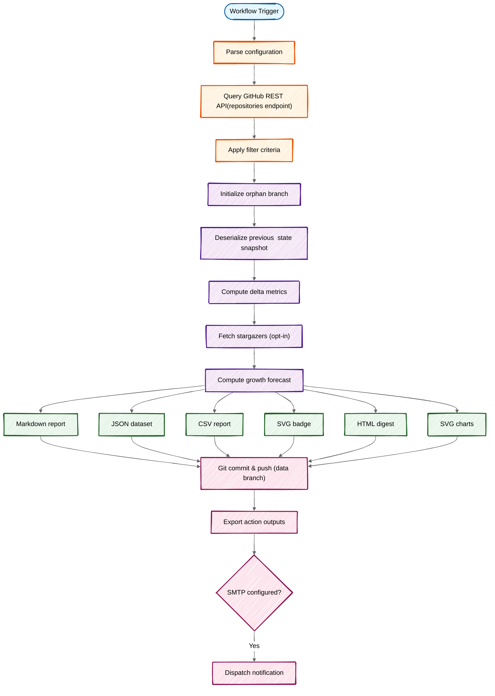

GitHub Star Tracker follows a systematic pipeline that queries repositories, tracks changes, generates reports, and commits artifacts to a dedicated data branch.

## Execution Pipeline

Every time the action runs, it executes the following workflow:



## Pipeline Stages

<Steps>
  <Step title="Configuration Loading">
    The action loads configuration from workflow inputs and optional YAML config file:

    ```typescript
    const config = loadConfig();
    const token = core.getInput('github-token', { required: true });
    const apiUrl = core.getInput('github-api-url') || process.env.GITHUB_API_URL || '';
    const octokit = github.getOctokit(token, ...(apiUrl ? [{ baseUrl: apiUrl }] : []));
    ```

    See [Configuration](/configuration/overview) for all available options.
  </Step>

  <Step title="Repository Fetching & Filtering">
    The action queries the GitHub REST API and applies filter criteria:

    ```typescript
    const repos = await getRepos({ octokit, config });
    ```

    Filters include:
    - **Visibility**: `public`, `private`, `all`, or `owned`
    - **Min stars**: Repos with at least N stars
    - **Archived/Forks**: Include or exclude archived repos and forks
    - **Regex patterns**: Exclude repos matching patterns
    - **Only repos**: Track only specific repositories

    The filtering logic is applied in `src/infrastructure/github/filters.ts:30`:

    ```typescript
    export function filterRepos({ repos, config }: FilterReposParams): GitHubRepo[] {
      if (config.onlyRepos.length > 0) {
        return repos.filter((repo) => config.onlyRepos.includes(repo.name));
      }

      let filtered = repos;
      if (!config.includeArchived) filtered = filtered.filter((repo) => !repo.archived);
      if (!config.includeForks) filtered = filtered.filter((repo) => !repo.fork);
      if (config.minStars > 0) filtered = filtered.filter((repo) => repo.stargazers_count >= config.minStars);
      
      return filtered;
    }
    ```
  </Step>

  <Step title="Data Branch Initialization">
    The action uses Git worktrees to manage the data branch separately from the main checkout:

    ```typescript
    await withDataDir(config.dataBranch, async (dataDir) => {
      // All data operations happen here
    });
    ```

    The `initializeDataBranch()` function (from `src/infrastructure/git/worktree.ts:6`):
    - Checks if the data branch exists on remote
    - Creates an orphan branch if it doesn't exist
    - Checks out the branch in a separate worktree directory
    - Cleans up the worktree when done

    <Info>
      The data branch is completely separate from your main branch, ensuring tracking data doesn't clutter your repository history.
    </Info>
  </Step>

  <Step title="State Comparison">
    The action deserializes the previous snapshot and computes delta metrics:

    ```typescript
    const history = readHistory(dataDir);
    const lastSnapshot = getLastSnapshot(history);
    const results = compareStars({ currentRepos: repos, previousSnapshot: lastSnapshot });
    ```

    The comparison produces a `ComparisonResults` object with:

    ```typescript
    interface ComparisonResults {
      repos: RepoResult[];  // Per-repository deltas
      summary: Summary;     // Aggregate metrics
    }

    interface Summary {
      totalStars: number;    // Current total star count
      totalPrevious: number; // Previous total star count
      totalDelta: number;    // Net change
      newStars: number;      // Stars gained
      lostStars: number;     // Stars lost
      changed: boolean;      // Whether any changes occurred
    }
    ```

    See the implementation in `src/domain/comparison.ts:8`.
  </Step>

  <Step title="Stargazer Tracking (Optional)">
    If enabled, the action fetches individual stargazers and identifies new ones:

    ```typescript
    if (config.trackStargazers) {
      const repoStargazers = await fetchAllStargazers({ octokit, repos });
      const previousMap = readStargazers(dataDir);
      stargazerDiff = diffStargazers({ current: repoStargazers, previousMap });
      writeStargazers({ dataDir, stargazerMap: buildStargazerMap(repoStargazers) });
    }
    ```

    <Note>
      Stargazer tracking is opt-in via `track-stargazers: true`. For large repositories, this can consume significant API quota.
    </Note>
  </Step>

  <Step title="Growth Forecast">
    The action computes 4-week growth forecasts using two methods:

    ```typescript
    const forecastData = computeForecast({ history, topRepoNames });
    ```

    **Forecast Methods** (from `src/domain/forecast.ts:11`):
    - **Linear Regression**: Fits a line to historical data
    - **Weighted Moving Average**: Applies higher weight to recent changes

    Forecasts require at least **3 snapshots** of historical data.
  </Step>

  <Step title="Report & Artifact Generation">
    The action generates multiple output formats:

    <Accordion title="Markdown Report">
      ```typescript
      const markdownReport = generateMarkdownReport({
        results,
        previousTimestamp,
        locale: config.locale,
        history,
        includeCharts: config.includeCharts,
        stargazerDiff,
        forecastData,
        topRepos: config.topRepos,
      });
      ```

      Written to `README.md` in the data branch. Includes summary tables, delta indicators, and embedded chart links.
    </Accordion>

    <Accordion title="HTML Report">
      ```typescript
      const htmlReport = generateHtmlReport({ /* same params */ });
      ```

      Used for email notifications. Includes inline styles and responsive design.
    </Accordion>

    <Accordion title="CSV Export">
      ```typescript
      const csvReport = generateCsvReport(results);
      ```

      Machine-readable export with columns: `Repository,Stars,Previous,Delta,Status`
    </Accordion>

    <Accordion title="SVG Badge">
      ```typescript
      const badge = generateBadge({ totalStars: summary.totalStars, locale: config.locale });
      ```

      Shields.io-style badge showing total star count.
    </Accordion>

    <Accordion title="SVG Charts">
      ```typescript
      const svgChart = generateSvgChart({ history, title: t.report.starHistory, locale: config.locale });
      const comparisonChart = generateComparisonSvgChart({ history, repoNames: topRepoNames, ... });
      const forecastChart = generateForecastSvgChart({ history, forecastData, locale: config.locale });
      ```

      Generates:
      - `star-history.svg` - Aggregate star history
      - `comparison.svg` - Top repositories comparison
      - `forecast.svg` - Growth forecast visualization
      - Per-repo charts: `{owner}-{repo}.svg`

      Charts require at least **2 snapshots** and use CSS media queries for dark/light mode support.
    </Accordion>
  </Step>

  <Step title="Data Persistence">
    All artifacts are written to the data branch and committed:

    ```typescript
    writeHistory({ dataDir, history: updatedHistory });
    writeReport({ dataDir, markdown: markdownReport });
    writeBadge({ dataDir, svg: badge });
    writeCsv({ dataDir, csv: csvReport });
    writeChart({ dataDir, filename: 'star-history.svg', svg: svgChart });

    const commitMsg = `Update star data: ${summary.totalStars} total (${deltaIndicator(summary.totalDelta)})`;
    commitAndPush({ dataDir, dataBranch: config.dataBranch, message: commitMsg });
    ```

    Files written to the data branch:
    - `stars-data.json` - Historical snapshots
    - `README.md` - Markdown report
    - `stars-badge.svg` - Star count badge
    - `stars-data.csv` - CSV export
    - `charts/*.svg` - All generated charts
    - `stargazers.json` - Stargazer tracking data (if enabled)
  </Step>

  <Step title="Action Outputs">
    The action exports outputs for workflow chaining:

    ```typescript
    core.setOutput('total-stars', String(summary.totalStars));
    core.setOutput('stars-changed', String(summary.changed));
    core.setOutput('new-stars', String(summary.newStars));
    core.setOutput('lost-stars', String(summary.lostStars));
    core.setOutput('should-notify', String(shouldNotify));
    core.setOutput('new-stargazers', String(newStargazers));
    core.setOutput('report', markdownReport);
    core.setOutput('report-html', htmlReport);
    core.setOutput('report-csv', csvReport);
    ```

    See [Outputs](/outputs) for detailed documentation.
  </Step>

  <Step title="Email Notification (Optional)">
    If SMTP is configured and threshold is reached:

    ```typescript
    const emailConfig = getEmailConfig(config.locale);
    if (emailConfig && (notify || config.sendOnNoChanges)) {
      await sendEmail({ emailConfig, subject, htmlBody: htmlReport });
    }
    ```

    Notifications support:
    - Fixed thresholds: Send when N stars change
    - Adaptive thresholds: `auto` mode adjusts based on total star count
    - Force send: `send-on-no-changes: true`
  </Step>
</Steps>

## Snapshot Management

The action maintains a rolling history of snapshots in `stars-data.json`:

```typescript
interface Snapshot {
  timestamp: string;    // ISO 8601 timestamp
  totalStars: number;   // Aggregate star count
  repos: SnapshotRepo[]; // Per-repository data
}

interface History {
  snapshots: Snapshot[];
  starsAtLastNotification?: number; // For adaptive thresholds
}
```

Snapshots are added and rotated based on `max-history` (default: 52 runs):

```typescript
const snapshot = createSnapshot({ currentRepos: repos, summary });
const updatedHistory = addSnapshot({ history, snapshot, maxHistory: config.maxHistory });
```

From `src/domain/snapshot.ts:17`:

```typescript
export function addSnapshot({ history, snapshot, maxHistory }: AddSnapshotParams): History {
  const snapshots = [...history.snapshots, snapshot].slice(-maxHistory);
  return { ...history, snapshots };
}
```

## Error Handling

The action wraps execution in try-catch and reports failures:

```typescript
try {
  await trackStars();
} catch (error) {
  const err = error as Error;
  core.setFailed(`Star Tracker failed: ${err.message}`);
  if (err.stack) core.debug(err.stack);
}
```

Common failure scenarios:
- Invalid or expired GitHub token
- Insufficient permissions
- Network/API errors
- Git push conflicts (rare with orphan branch)

## Next Steps

<CardGroup cols={2}>
  <Card title="Architecture" icon="sitemap" href="/architecture">
    Explore the layered architecture and design patterns
  </Card>
  <Card title="Outputs" icon="arrow-up-right-from-square" href="/outputs">
    Learn how to use action outputs in your workflows
  </Card>
  <Card title="Configuration" icon="gear" href="/configuration/overview">
    Configure filtering, charts, and notifications
  </Card>
  <Card title="Data Management" icon="database" href="/guides/data-management">
    Understand snapshot rotation and manual data management
  </Card>
</CardGroup>
